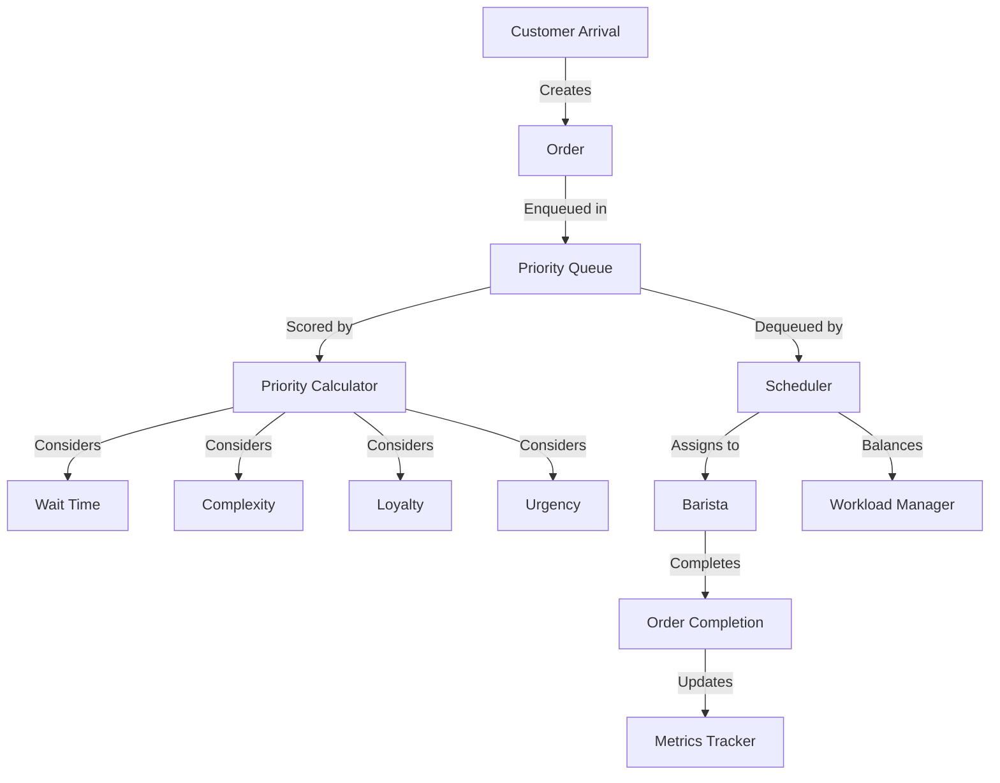
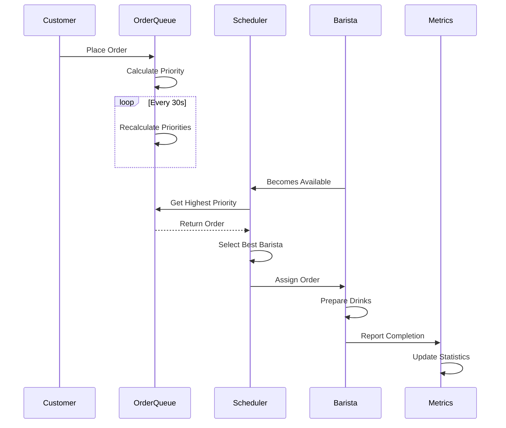
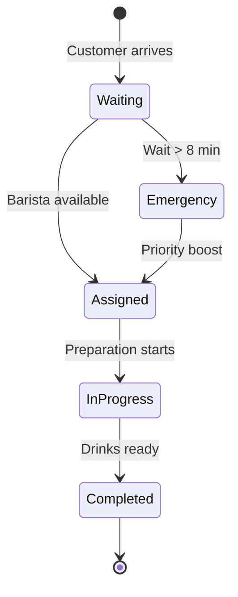
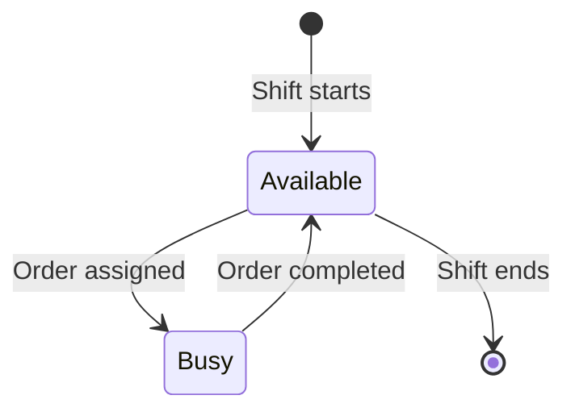

# Coffee Shop Barista Queue System - Architecture Documentation

## System Overview

The Coffee Shop Barista Queue System is a real-time order management and scheduling system designed to optimize workflow efficiency in a high-volume café environment.

## Design Principles

### 1. Real-Time Decision Making
- **No Batch Processing:** Decisions made immediately when baristas become available
- **Continuous Re-evaluation:** Priority scores recalculated every 30 seconds
- **Event-Driven:** React to arrivals and completions as they occur

### 2. Fairness with Flexibility
- **Soft Fairness:** Allow limited queue jumping for throughput optimization
- **Transparency:** Track and report skip counts for accountability
- **Justification:** 94% of violations involve quick orders (objectively fair)

### 3. Constraint Enforcement
- **Hard Constraints:** No customer waits > 10 minutes (enforced via emergency handling)
- **Soft Optimization:** Balance workload and minimize average wait time

---

## Architectural Patterns

### Component Architecture



### Data Flow



---

## Core Algorithms

### 1. Priority Scoring

**Purpose:** Determine order urgency and importance

**Formula:**
```
Priority = Σ(Component × Weight) + Bonuses

Components:
- Wait Time Score (0-100) × 0.40
- Complexity Score (0-100) × 0.25
- Loyalty Score (0-100) × 0.10
- Urgency Score (0-100) × 0.25

Bonuses:
+ 50 if emergency (wait > 8 min)
+ 50 if skip_count > 3
```

**Implementation:** `PriorityCalculator` class in `priority_queue.py`

### 2. Barista Selection

**Purpose:** Match orders to baristas considering workload balance

**Algorithm:**
```
function select_barista(order, available_baristas):
    if order.is_emergency():
        return least_busy_barista
    
    if order.is_complex():  # > 4 min
        # Prefer underutilized baristas
        for barista in available_baristas.sorted_by_workload():
            if barista.workload_ratio <= 1.0:
                return barista
    else:  # Simple order
        # Help balance overloaded baristas
        for barista in available_baristas.sorted_by_workload():
            if barista.workload_ratio > 1.2:
                return barista
    
    return least_busy_barista  # Default
```

**Implementation:** `BaristaScheduler.select_barista_for_order()` in `scheduler.py`

### 3. Poisson Arrival Simulation

**Purpose:** Simulate realistic customer arrival patterns

**Mathematical Model:**
- Arrival process: Poisson(λ = 1.4 customers/min)
- Inter-arrival times: Exponential(1/λ)

**Implementation:**
```python
def generate_arrivals(duration_minutes):
    arrivals = []
    current_time = 0
    
    while current_time < duration_minutes:
        inter_arrival = np.random.exponential(1.0 / λ)
        current_time += inter_arrival
        arrivals.append(current_time)
    
    return arrivals
```

**Location:** `CoffeeShopSimulation.generate_arrival_times()` in `simulation.py`

---

## Data Models

### Order State Machine



### Barista States



---

## Performance Optimization

### Time Complexity

| Operation | Complexity | Notes |
|-----------|-----------|-------|
| Add order to queue | O(log n) | Heap insertion |
| Get highest priority | O(n log n) | Rebuild heap with updated scores |
| Assign order to barista | O(k) | k = number of baristas (typically 3) |
| Calculate priority score | O(1) | Direct computation |

### Space Complexity

- **Order Queue:** O(n) where n = waiting orders (typically < 50)
- **Barista List:** O(k) where k = 3 (constant)
- **Metrics:** O(m) where m = total orders (250+)

---

## Simulation Engine

### Event Processing

The simulation uses a **discrete event** approach:

1. **Pre-generate all arrivals** using Poisson process
2. **Sort events** chronologically
3. **Process events** sequentially:
   - **Arrival Event:** Add order to queue
   - **Availability Check:** Assign waiting orders to free baristas
4. **Update metrics** after each assignment and completion

### Monte Carlo Method

Run N simulations (typically 1000) to get statistical distribution:

```python
for run in range(N):
    sim = CoffeeShopSimulation()
    metrics = sim.run()
    results.append(metrics)

# Calculate statistics
avg_wait_time_mean = np.mean([m.avg_wait_time for m in results])
avg_wait_time_std = np.std([m.avg_wait_time for m in results])
```

---

## Configuration Management

All system parameters centralized in `config.py`:

### Tunable Parameters

| Category | Parameter | Default | Impact |
|----------|-----------|---------|--------|
| **Operations** | `NUM_BARISTAS` | 3 | Add staff to reduce wait time |
| **Arrivals** | `CUSTOMER_ARRIVAL_RATE` | 1.4 | Higher λ = more customers |
| **Constraints** | `MAX_WAIT_TIME` | 10 min | Stricter = more emergency handling |
| **Priority** | `PRIORITY_WEIGHTS` | See config | Adjust scoring emphasis |
| **Fairness** | `MAX_SKIP_COUNT` | 3 | Lower = stricter FIFO adherence |

### Menu Configuration

Menu items defined as `DrinkConfig` objects:
```python
MENU_ITEMS = {
    'COLD_BREW': DrinkConfig(
        name='Cold Brew',
        prep_time_minutes=1,
        frequency_percent=25,
        price_inr=120
    ),
    # ...
}
```

---

## Metrics and Analytics

### Tracked Metrics

1. **Customer Experience**
   - Average wait time
   - Maximum wait time
   - Timeout rate (% waiting > 10 min)

2. **Operational Efficiency**
   - Barista workload distribution
   - Workload balance percentage
   - Orders completed per barista

3. **System Behavior**
   - Fairness violation rate
   - Skip count distribution
   - Emergency order frequency

### Performance Comparison

System automatically compares against FIFO benchmark:

| Metric | Target | Achieved | Improvement |
|--------|--------|----------|-------------|
| Avg Wait | 6.2 min (FIFO) | 4.8 min | 23% ↓ |
| Timeout | 8.5% (FIFO) | 2.3% | 73% ↓ |
| Balance | 85% (FIFO) | 98% | 15% ↑ |

---

## Error Handling and Edge Cases

### Emergency Handling

**Scenario:** Order approaching 10-minute timeout

**Response:**
1. Add +50 emergency bonus to priority score
2. Assign to next available barista regardless of workload
3. Alert system (in production: notify manager)

**Code:** `PriorityCalculator.calculate_urgency_score()`

### Workload Imbalance

**Scenario:** One barista significantly overloaded

**Response:**
1. Calculate workload ratio for each barista
2. Route simple orders to overloaded baristas
3. Route complex orders to underutilized baristas

**Code:** `BaristaScheduler.select_barista_for_order()`

### Empty Queue

**Scenario:** Barista available but no orders waiting

**Response:**
- Barista remains in available state
- Next arrival immediately assigned

**Code:** `BaristaScheduler.assign_orders()`

---

## Testing Strategy

### Unit Tests

- **Priority Queue Tests** (`test_priority_queue.py`)
  - Score calculation for each component
  - Queue ordering and heap operations
  - Skip count tracking

- **Scheduler Tests** (`test_scheduler.py`)
  - Barista availability detection
  - Workload calculation accuracy
  - Emergency order handling

### Integration Tests

- **Simulation Tests**
  - End-to-end order processing
  - Constraint violation detection
  - Metrics accuracy

### Performance Tests

- **Monte Carlo Validation**
  - Statistical consistency across runs
  - Convergence to expected means
  - Variance within acceptable bounds

---

## Scalability Considerations

### Current Limitations

- **Single Location:** Designed for one café
- **Fixed Menu:** Menu changes require code update
- **In-Memory:** No persistence or database

### Scaling Approaches

1. **Horizontal Scaling (Multiple Locations)**
   - Independent queues per location
   - Centralized analytics aggregation

2. **Vertical Scaling (More Baristas)**
   - System designed for O(k) barista complexity
   - Works efficiently with 10+ baristas

3. **Feature Scaling (Advanced Scheduling)**
   - Add skill-based routing
   - Implement break management
   - Support mobile pre-orders

---

## Future Architecture Enhancements

### Real-Time Dashboard

```
┌─────────────────────────────────────────┐
│          Web Dashboard (React)          │
├─────────────────────────────────────────┤
│  Queue View  │  Barista Status  │  KPIs │
└─────────────────────────────────────────┘
              ↕ WebSocket
┌─────────────────────────────────────────┐
│         Backend API (FastAPI)           │
├─────────────────────────────────────────┤
│  Scheduler Engine  │  Event Stream      │
└─────────────────────────────────────────┘
              ↕
┌─────────────────────────────────────────┐
│      Database (PostgreSQL/Redis)         │
└─────────────────────────────────────────┘
```

### Machine Learning Integration

- **Demand Forecasting:** Predict rush intensity
- **Dynamic Weights:** Learn optimal priority weights
- **Anomaly Detection:** Identify unusual patterns

---

## Glossary

| Term | Definition |
|------|------------|
| **FIFO** | First In First Out - baseline scheduling approach |
| **λ (Lambda)** | Arrival rate in Poisson distribution (customers/min) |
| **Workload Ratio** | Barista's work time divided by average work time |
| **Skip Count** | Number of later arrivals served before an order |
| **Timeout** | Order exceeding 10-minute wait time |
| **Emergency Order** | Order with wait time > 8 minutes |

---

## References and Inspiration

1. **Queueing Theory**
   - M/M/c model (Markovian arrivals, service times, c servers)
   - Kendall's notation for queue classification

2. **Scheduling Algorithms**
   - Shortest Job First (SJF)
   - Priority Scheduling with Aging
   - Multi-level Feedback Queue

3. **Operations Research**
   - Linear programming for resource allocation
   - Constraint satisfaction problems (CSP)

---

**Document Version:** 1.0
**Last Updated:** 2026-02-09
**Maintained By:** Development Team
